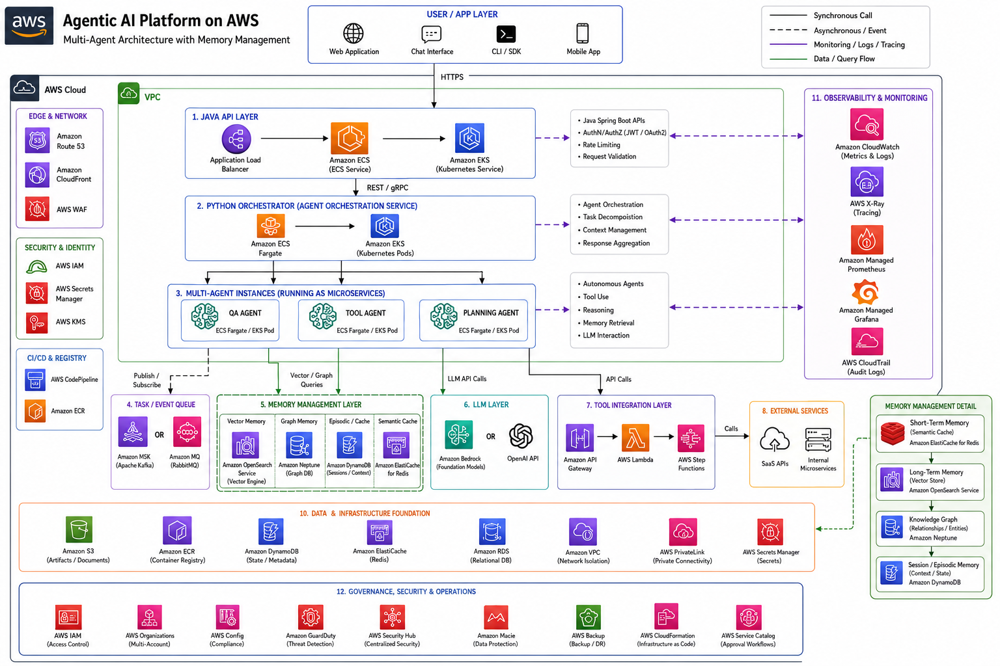

# Agentic AI Enterprise Architecture on AWS

## Overview

This repository demonstrates a **production-ready architecture for Agentic AI systems** deployed on AWS. The system is designed for **enterprise-grade knowledge work automation**, where multiple agents collaborate to answer queries, perform tool integrations, and maintain long-term memory.  

The architecture follows a **multi-layer design**, including:

- User / Application Layer
- Java API / Microservices Layer
- Python Agent Orchestrator Layer
- Multi-Agent Instances
- Task Queue / Messaging Layer
- Memory / Knowledge Layer
- LLM Layer
- Tool Integration Layer
- Monitoring & Governance
- AWS Cloud Infrastructure

The system is optimized for **scalability, modularity, observability, and security**.

---

## Architecture Diagram



**Diagram Highlights:**

- Each layer corresponds to a specific function in the enterprise Agentic AI system.
- Python-based agent orchestration handles multi-agent workflows.
- Memory and vector databases enable Retrieval-Augmented Generation (RAG) pipelines.
- Tool integration is securely managed via AWS API Gateway and Lambda / Step Functions.
- Monitoring and governance are provided via CloudWatch, X-Ray, Prometheus, and Grafana.
- Cloud infrastructure uses VPC, ECS/EKS, ALB, IAM, S3, and ECR.

---

## Layers and Components

### 1. User / Application Layer
- **Description:** Users interact through web, chat, or CLI interfaces.
- **AWS Services:** N/A (frontend clients)
- **Notes:** All requests go through secure HTTPS endpoints to the API layer.

### 2. Java API / Microservices Layer
- **Description:** Handles authentication, session management, and request routing.
- **AWS Services:** ECS / EKS behind ALB
- **Tech Stack:** Java Spring Boot, REST / gRPC
- **Role:** Exposes endpoints for agent workflows and orchestrates multi-agent operations.

### 3. Python Agent Orchestrator Layer
- **Description:** Central workflow engine managing multi-agent interactions.
- **AWS Services:** ECS Fargate / EKS
- **Tech Stack:** Python 3.11, LangChain, AutoGen
- **Role:** 
  - Receives requests from the Java API layer.
  - Assigns tasks to specialized agent instances.
  - Handles retries, failure management, and multi-step workflows.

### 4. Agent Instances
- **Description:** Individual agents specialized for specific tasks.
  - **QA Agent:** Performs Retrieval-Augmented Generation (RAG) queries.
  - **Tool Agent:** Executes API calls to internal or SaaS tools.
  - **Planning Agent:** Coordinates multi-step workflows and task decomposition.
- **AWS Services:** ECS Fargate / EKS Pods
- **Scaling:** Horizontal scaling per agent type.

### 5. Task Queue / Messaging Layer
- **Description:** Decouples agent communication and orchestrator tasks.
- **AWS Services:** Amazon MQ (RabbitMQ) / Amazon MSK (Kafka)
- **Role:** Handles publish/subscribe patterns for task execution and coordination.

### 6. Memory / Knowledge Layer
- **Description:** Provides long-term memory and context for agents.
- **Components:**
  - **Vector Database:** Stores embeddings for RAG queries.
  - **Knowledge Graph:** Stores structured enterprise knowledge for semantic reasoning.
- **AWS Services:** Amazon OpenSearch Service, or self-managed Weaviate / Pinecone on EC2/EKS
- **Agent Memory Management:**
  - Agents retrieve relevant context via vector similarity search.
  - Long-term memory persists across sessions, while short-term memory is cached for active workflows.
  - Memory updates are versioned and indexed to maintain consistency.

### 7. LLM Layer
- **Description:** Provides reasoning, planning, and natural language understanding.
- **AWS Services:** Amazon Bedrock (Claude, Mistral, Titan) or external APIs (OpenAI)
- **Characteristics:** Stateless; horizontal scaling enabled.

### 8. Tool Integration Layer
- **Description:** Enables agents to perform actions in external systems.
- **AWS Services:** API Gateway + Lambda / Step Functions
- **Notes:** API Gateway provides secure entry, authentication, rate limiting, and monitoring. Lambda/Step Functions execute business logic and API calls to SaaS or internal services.

### 9. Monitoring & Governance
- **Description:** Observability, metrics, tracing, and audit logging.
- **AWS Services:** CloudWatch, X-Ray, Prometheus, Grafana
- **Role:** Tracks agent performance, LLM usage, RAG accuracy, latency, and cost metrics.

### 10. Cloud Infrastructure
- **Description:** Secure, scalable deployment environment.
- **AWS Services:** VPC, IAM, S3, EFS, ECR
- **Notes:** 
  - ECS/EKS for container orchestration.
  - ALB for load balancing.
  - IAM for role-based access control.
  - Secrets Manager for secure credential storage.

---

## Component Interaction Flow

1. User sends a request via Web/Chat/CLI → Java API Layer.
2. Java API Layer validates request, enriches context → forwards to Python Orchestrator.
3. Orchestrator assigns tasks to Agent Instances via REST/gRPC or Task Queue.
4. Agent Instances:
   - Retrieve context from Memory Layer (Vector DB / Knowledge Graph).
   - Call LLM Layer for reasoning.
   - Execute tool calls via Tool Integration Layer if needed.
5. Responses aggregated by Orchestrator → returned to Java API → sent back to user.
6. Monitoring Layer captures metrics, logs, and traces for all interactions.

---

## Scaling and Deployment Notes

- **ECS Fargate:** Simplified container management for Python orchestrator and agent instances.
- **EKS:** Optional Kubernetes cluster for advanced multi-agent orchestration.
- **Task Queue:** Supports asynchronous workflows and decouples orchestrator-agent communication.
- **Memory Layer:** Persisted embeddings and knowledge graph allow agents to maintain context over long sessions.
- **LLM Calls:** Stateless API calls enable horizontal scaling based on user demand.
- **Tool Integration:** Securely handled through API Gateway and serverless Lambda/Step Functions.

---

## Getting Started

1. Clone this repository:

```bash
git clone https://github.com/your-org/agentic-ai-aws.git
cd agentic-ai-aws